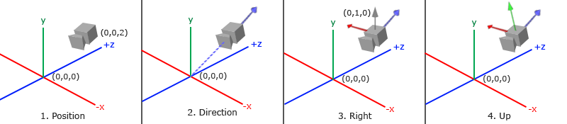
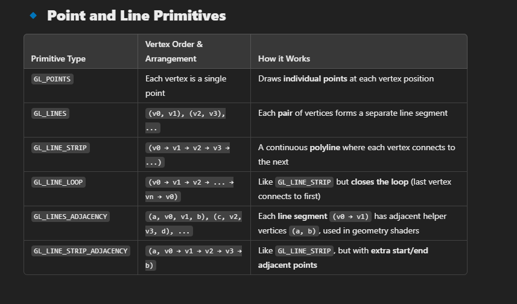
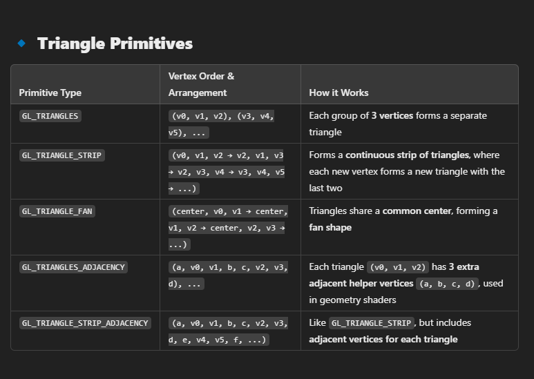
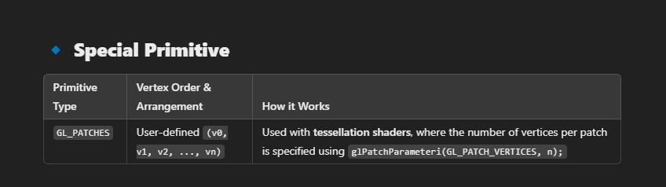

# OpenGL

- Everything in in 3D

- The Graphics Pipeline

Basically, 3D coordinates get converted to 2D coordinates with specific color.

- Graphic Processing Units (GPUs) utilize alot of cores to execute very simple processes in parallel.
- For example, applying a function to every pixel in the screen at the same time.
- This simple process that runs on the cpu is called **shaders** and is specified with the **GLSL** ( OpenGL Shading Language ) language

Terminology
- Vertex (a coordinate point or a vector, usually 3D)
  

# Graphics Pipeline
## Vertex Shader
- takes a single vertex and does transformations on it.
- We send a array of vertex data. (Vertex[])
# Vertex Attributes
- Basically defining what each vertex has, its size etc...

- The first parameter specifies which vertex attribute we want to configure. Remember that we specified the location of the position vertex attribute in the vertex shader with layout (location = 0). This sets the location of the vertex attribute to 0 and since we want to pass data to this vertex attribute, we pass in 0.
- The next argument specifies the size of the vertex attribute. The vertex attribute is a vec3 so it is composed of 3 values.
- The third argument specifies the type of the data which is GL_FLOAT (a vec* in GLSL consists of floating point values).
- The next argument specifies if we want the data to be normalized. If we're inputting integer data types (int, byte) and we've set this to GL_TRUE, the integer data is normalized to 0 (or -1 for signed data) and 1 when converted to float. This is not relevant for us so we'll leave this at GL_FALSE.
- The fifth argument is known as the stride and tells us the space between consecutive vertex attributes. Since the next set of position data is located exactly 3 times the size of a float away we specify that value as the stride. Note that since we know that the array is tightly packed (there is no space between the next vertex attribute value) we could've also specified the stride as 0 to let OpenGL determine the stride (this only works when values are tightly packed). Whenever we have more vertex attributes we have to carefully define the spacing between each vertex attribute but we'll get to see more examples of that later on.
- The last parameter is of type void* and thus requires that weird cast. This is the offset of where the position data begins in the buffer. Since the position data is at the start of the data array this value is just 0. We will explore this parameter in more detail later on

# VBO - Vertex Buffer Object
- To allocate space in the GPU memory for the vertex data, this datastructure is used to manage the memory.
- We can send large amounts of data at once using these VBOs instead of sending one at a time.

# VAO - Vertex Array Object

- VAO stores the state of the data.
- VAO has 16 different slots to store attribute pointers
  - Calls to glEnableVertexAttribArray or glDisableVertexAttribArray.
  - Vertex attribute configurations via glVertexAttribPointer.
  - Vertex buffer objects associated with vertex attributes by calls to glVertexAttribPointer.
- instead of setting VBOs and attrib pointers again and again , we set VBOs and attrib pointers as required and bind it to a VAO.
- So when we want to use it. we just need to bind VAO and the rest just works.

# EBO - Element Buffer Objects

- To create a model we use multiple vertices. and they are joined as triangles.
- Sometimes these triangles may share a vertex. for example a rectangle would be made of two triangles and two vertices would be shared between them.
- On bigger models this would just increase memory!
- EBO is just like a VBO but helps us to draw based on "indexes" to specify the order in which we can draw.
- 
# Vertex Primitives
- A Vertex[] can be imagined to make multiple shapes, maybe each vertex is a point, or every three consecutive points form a triangle.
- This needs to be specified by GL_PRIMITIVES Like
    - GL_POINTS
    - GL_TRIANGLES
    - GL_LINE_STRIP etc..
  

# Fragment Shader
- A fragment in OpenGL is all the data required for OpenGL to render a single pixel.
- here we define the final color of the pixel.
- Lighting ,shadows, color are all finalized here.

#Camera

$$
LookAt = \begin{bmatrix} \color{red}{R_x} & \color{red}{R_y} & \color{red}{R_z} & 0 \\ \color{green}{U_x} & \color{green}{U_y} & \color{green}{U_z} & 0 \\ \color{blue}{D_x} & \color{blue}{D_y} & \color{blue}{D_z} & 0 \\ 0 & 0 & 0  & 1 \end{bmatrix} * \begin{bmatrix} 1 & 0 & 0 & -\color{purple}{P_x} \\ 0 & 1 & 0 & -\color{purple}{P_y} \\ 0 & 0 & 1 & -\color{purple}{P_z} \\ 0 & 0 & 0  & 1 \end{bmatrix}
$$

# Lighting

In real life, an object gets a ray (usually sunlight).
- this ray would be absorbed by the object. and what is reflected is what we perceive as color.
- This phenomenon can be digitized as

perceived_color = object_color * lightColor

where all colors are RGB values with 3 Dimensions.

so we can see when light Color is 1,1,1 (WHITE) , The perceived color is basically the objects color.
but if the perceived color is something like (0,1,0) ( GREEN ),
only the green channel of the object is reflected.
Therefore a RED object cannot be really seen properly under a green light. and and so on!

- Ambient lighting: even when it is dark there is usually still some light somewhere in the world (the moon, a distant light) so objects are almost never completely dark. To simulate this we use an ambient lighting constant that always gives the object some color.
- Diffuse lighting: simulates the directional impact a light object has on an object. This is the most visually significant component of the lighting model. The more a part of an object faces the light source, the brighter it becomes.
- Specular lighting: simulates the bright spot of a light that appears on shiny objects. Specular highlights are more inclined to the color of the light than the color of the object.
# Note

- Vertex must have values between [-1,1] also known as NDC ( Normalized Device coordinates )

- Specifically, the data returned by the vertex shader MUST be in NDC
- The NDC to device screen is transformed by the fragment shader using glViewport information
- Sending data to the graphics card from the CPU is relatively slow, so wherever we can we try to send as much data as possible at once.

# Primitives

